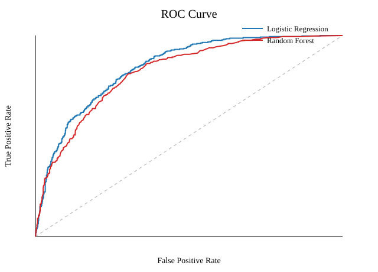
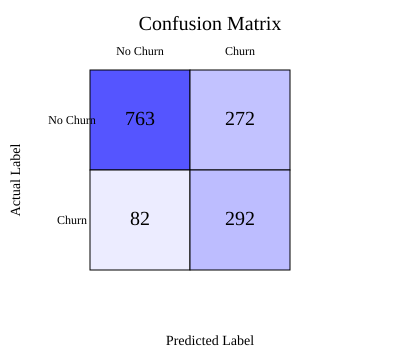

# Customer Churn Prediction & Retention Strategy

An end-to-end analytics project that turns 7,043 anonymized telecom customer records into a practical retention decision. The workflow compares two classification models, selects an operating threshold based on F1 score, identifies the strongest churn drivers, and translates the results into targeted retention actions.

## Executive summary

- **Selected model:** Random Forest
- **Test ROC-AUC:** 0.863
- **Decision threshold:** 0.30
- **Recall:** 0.767
- **Precision:** 0.568
- **High-value customers:** 1,605 (22.8% of the customer base)
- **High-value customers flagged at risk:** 17 (1.1% of the high-value segment)

The lower 0.30 threshold prioritizes recall: it captures more potential churners when missing a customer is considered more costly than reviewing a false positive.

## Business findings

The strongest churn signals were:

1. Month-to-month contracts
2. Short customer tenure
3. Higher monthly charges
4. Missing online security or technical support
5. Electronic-check payments

The recommended retention queue ranks customers by high-value status, predicted churn probability, and then margin or ARPU. Suggested actions include renewal price protection, bill-optimization reviews, temporary premium support, and incentives to move to automatic payment.

## Method

1. Clean and validate customer data
2. Convert the churn target to a binary outcome
3. Split data into stratified train and test sets
4. Impute, scale, and one-hot encode features
5. Compare Logistic Regression and Random Forest
6. Tune the classification threshold for F1
7. Evaluate ROC-AUC, precision, recall, accuracy, and confusion matrix
8. Translate model output into a retention proposal

## Model performance





Detailed outputs are available in [metrics.json](reports/metrics.json), [model diagnostics](reports/model_diagnostics.md), and the [business recommendation](reports/recommendation.md).

## Repository structure

| Path | Purpose |
| --- | --- |
| `src/churn_model.py` | Reproducible pandas and scikit-learn pipeline |
| `src/churn_model_fallback.py` | Standard-library fallback implementation |
| `reports/` | Metrics, diagnostics, charts, and recommendations |
| `slides/` | Presentation outline |
| `telco_churn.csv` | Anonymized project dataset |

## Run locally

```bash
python -m venv .venv
# Windows: .venv\Scripts\activate
# macOS/Linux: source .venv/bin/activate
pip install -r requirements.txt
python src/churn_model.py
```

The generated outputs are written to `reports/`.

## What this project demonstrates

- Python analytics with pandas and scikit-learn
- Data cleaning and feature preprocessing
- Classification model comparison and threshold selection
- Model diagnostics and transparent limitations
- Translation of technical results into commercial actions

## Limitations

This is a portfolio and academic analysis using a public, anonymized dataset. The results show associations rather than causal effects. A production version would require fresh company data, cost-based threshold selection, model monitoring, bias checks, and controlled testing of retention offers.
